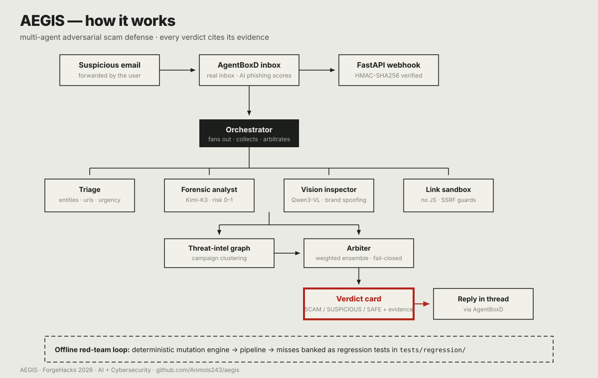

# AEGIS — Multi-Agent Adversarial Scam Defense

**ForgeHacks 2026 · AI + Cybersecurity track**
*Track prompt: "Build an AI-powered solution that helps people recognize, prevent, verify, or respond to scams, impersonation, and fraud enabled by AI or modern technologies."*

Forward any suspicious email to AEGIS. A pipeline of specialist AI agents — triage, forensic analysis, visual brand-impersonation inspection, link sandboxing — dissects it, cross-references a threat-intelligence graph of known scam campaigns, and replies with an **evidence-cited verdict: SCAM / SUSPICIOUS / LIKELY SAFE**. A red-team engine continuously mutates real scams to probe the pipeline's blind spots; every miss becomes a permanent regression test.

*See the case-file dashboard from the live run: [`dashboard/index.html`](dashboard/index.html). (A rendered screenshot, `dashboard/screenshot.png`, is in the repo for the Devpost upload.)*

## The problem

Phishing remains the #1 way people get compromised, and AI-generated lures are now hyper-personalized and visually convincing. Spam filters give a silent binary verdict — non-technical users never learn *why* something is a scam, so they stay vulnerable to the next variant.

## How it works

```
                    ┌─────────────┐
                    │  AgentBoxD  │  real inbox for the agent
                    │    inbox    │  + injection/phishing/auth scores
                    └──────┬──────┘
                           │ signed webhook (HMAC-SHA256)
                    ┌──────▼──────┐
                    │   FastAPI   │  /webhook/agentboxd
                    │  receiver   │
                    └──────┬──────┘
                           │
                    ┌──────▼──────┐
                    │ Orchestrator│
                    └──────┬──────┘
                           │
              ┌────────────┼────────────┐
              ▼            ▼            ▼
        ┌──────────┐ ┌──────────┐ ┌──────────┐
        │ Triage   │ │ Forensic │ │ Vision   │
        │ (fast)   │ │ (256K)   │ │ Inspector│
        └────┬─────┘ └────┬─────┘ └────┬─────┘
             │            │            │
             │     ┌──────▼──────┐     │
             │     │Link Sandbox │     │
             │     └──────┬──────┘     │
              └────────────┼────────────┘
                           ▼
                    ┌──────────────┐
                    │ Threat graph │  campaign clustering
                    │  (networkx)  │
                    └──────┬───────┘
                           ▼
                    ┌──────────────┐
                    │   Arbiter    │  ensemble verdict + calibrated confidence
                    └──────┬───────┘
                           ▼
              ┌────────────────────────┐
              │ Verdict card → reply   │  via AgentBoxD
              │ Case-file dashboard    │  dashboard/
              └────────────────────────┘

   Offline loop: Red-team engine ──mutates──► pipeline ──miss──► tests/regression/
```

Every verdict cites its evidence: header lines, URLs, phrases, screenshots. No black boxes.



## Sponsor resources used

| Resource | Role in AEGIS |
|---|---|
| **AgentBoxD** | Real agent inbox; inbound injection/phishing/SPF-DKIM-DMARC scores used as *features*; signed webhooks; reply channel |
| **Featherless AI** | The agent ensemble — triage and forensic analyst (`moonshotai/Kimi-K3`), vision inspector (`Qwen/Qwen3-VL-30B-A3B-Instruct`). Red-team mutation is a deterministic in-repo engine, not an LLM call |
| **n8n** | Webhook → pipeline → reply orchestration plumbing (workflow draft in `n8n/`) |
| **Momen** | Evaluated for the campaign dashboard; shipped a static case-file dashboard instead (`dashboard/`) |
| **YouCam API** | Not used in the final build |
| **DevSwarm** | Not used in the final build |

## Quickstart

```bash
python -m venv .venv && source .venv/bin/activate
pip install -r requirements.txt
cp .env.example .env   # fill in FEATHERLESS_API_KEY, AGENTBOXD_API_KEY, ...
# Phase 1 smoke test (no inbox needed):
python scripts/smoke_llm.py
# Webhook receiver:
uvicorn aegis.ingress.webhook:app --port 8000
```

See [ARCHITECTURE.md](ARCHITECTURE.md) for the full design and [BUILD_PLAN.md](BUILD_PLAN.md) for the day-by-day plan.

## Live dashboard

```bash
PYTHONPATH=src .venv/bin/python -m uvicorn aegis.dashboard.app:app --port 8001
# open http://localhost:8001
```

Every analysis the webhook completes is recorded to SQLite (`data/dashboard.db`)
and served as JSON (`/api/verdicts`, `/api/campaigns`, `/api/redteam`,
`/api/stats`) plus a live page: verdict feed with expandable evidence,
campaign table, red-team board. Polls every 5s. The static case file
(`dashboard/index.html`) remains the frozen record of the first live run.

## Current status (Oct 5)

- Full pipeline implemented; offline suite green: `python -m unittest tests.test_offline` — **77/77 pass** (incl. 40+ security regression tests).
- Security-hardening pass (Oct 5): vision renderer default-deny egress isolation; webhook idempotency (redelivery never re-analyzes/re-replies); prompt-injection hardening on every LLM stage (`<UNTRUSTED_EMAIL>` delimiters); strict model-output validation with evidence-grounding (fabricated quotes dropped); sandbox SSRF deny-list extended (IPv6 link-local) + honest DNS-TOCTOU documentation.
- Deterministic security-signal layer (13 checks, zero LLM): SPF/DKIM/DMARC, From/Reply-To mismatch, display-name spoofing, URL display-vs-href mismatch, punycode/homoglyphs, IP-literal URLs, shorteners, suspicious TLDs, attachment static triage, suspicious phones. Fed to forensic as verified facts; surfaced on the verdict card and dashboard.
- Fan-out is now genuinely parallel (threads) with per-stage timings; sandbox reports redirect chains, form/download detection, durations; arbiter exposes strongest signals, agreement, and evidence completeness (score math frozen — documented 0.75 holds).
- Red team expanded: URL display-mismatch, sender-spoof, and **prompt-injection** mutation axes; `regression_summary()` (fixtures/caught/missed/fixed/open).
- Live runs on Featherless (vault-backed skill, no keys in repo): triage + forensic on `moonshotai/Kimi-K3`, vision on `Qwen/Qwen3-VL-30B-A3B-Instruct`. Sample PayPal phish → **SCAM** on the production path (score 0.75, forensic 0.97, AgentBoxD 0.92, sandbox 0.30 — domain unresolvable); SUSPICIOUS at 0.69 standalone.
- Live AgentBoxD inbox created; outbound reply path verified end-to-end against the API.
- Red-team engine: 5-variant demo run banked 5 regression fixtures (`tests/regression/rt-20261004-*.json`); run it yourself with `python scripts/redteam_demo.py`.
- Dashboards: live at `:8001` (verdict feed + deterministic signals + stage timings + next actions + campaigns + red-team board; optional token auth and PII redaction) and [`dashboard/index.html`](dashboard/index.html) — static case file of the live run.
- Deterministic demo mode: `python scripts/demo.py --mode deterministic` replays captured real artifacts with zero LLM calls (beats 1 & 3).
- Synthetic eval (`eval/EVAL.md`, n=15): **100% of scams flagged, 100% of legit mail cleared, zero false positives** (P/R/F1 = 1.00/1.00/1.00); latency mean/p50/p95 = 15.0/16.4/20.4s; ablation flags `--no-signals/--no-sandbox/--no-vision`. Scam recall@SCAM is 0% without provider enrichment — the ensemble is deliberately conservative; with the AgentBoxD signal the same sample scores 0.75 → SCAM.
- Still open: end-to-end test with a real forwarded email, demo video, Devpost submission (locks Oct 10, 12:00 PM ET).

## What was built with AI (honesty note, per hackathon rules)

Built during the ForgeHacks window (Oct 3–10, 2026) with AI coding assistance (Claude Code / Muse). AgentBoxD, Featherless, n8n, Momen, and YouCam are third-party sponsor APIs used as infrastructure. All agent prompts, pipeline logic, threat-graph code, and evaluation are original to this project.

## Submission checklist

- [x] Track selected: AI + Cybersecurity
- [ ] Demo video (2–4 min) on YouTube — see `demo/DEMO_SCRIPT.md`
- [x] GitHub repo + this README — https://github.com/Anmols243/aegis
- [ ] Devpost writeup: problem, technical approach, impact
- [x] Screenshots / architecture diagram — `dashboard/screenshot.png`, ASCII diagram above
